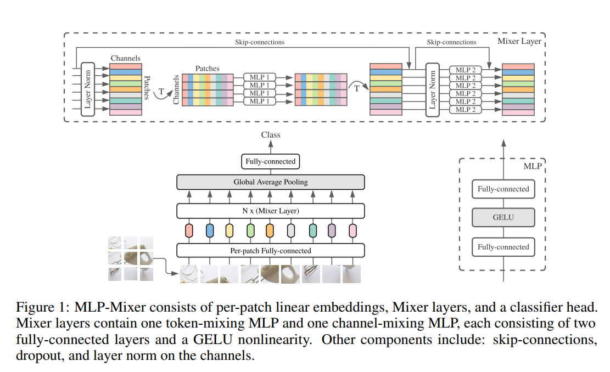

# Re-implementation of: "MLP-Mixer: An all-MLP Architecture for Vision"
###### This is the implementation version of [MLP mixer](https://doi.org/10.48550/arXiv.2105.01601)
___

In this repository, I tried implementing the MLP mixer using the PyTorch framework. After that, I applied to solve the CV' problem.

### MLP mixer architecture

> Model's architecture

### Run
```cmd
python train.py --batch_size 32 --save_path "./root" --image_size 32x32 --train_ratio 0.8 --device "cuda" --learning_rate 0.01 --channels 3 --depth 4 --hidden_dim 512 --patch_size 4 --epochs 100 --token_dim 256 --channel_dim 2048 --dropout_rate 0.2
```

### Application

Check my notebook for the MLP mixer application at [here](./notebooks)

### CITATIONS
```bibtex
@misc{tolstikhin2021mlpmixer,
    title   = {MLP-Mixer: An all-MLP Architecture for Vision},
    author  = {Ilya Tolstikhin and Neil Houlsby and Alexander Kolesnikov and Lucas Beyer and Xiaohua Zhai and Thomas Unterthiner and Jessica Yung and Daniel Keysers and Jakob Uszkoreit and Mario Lucic and Alexey Dosovitskiy},
    year    = {2021},
    eprint  = {2105.01601},
    archivePrefix = {arXiv},
    primaryClass = {cs.CV}
}
```
